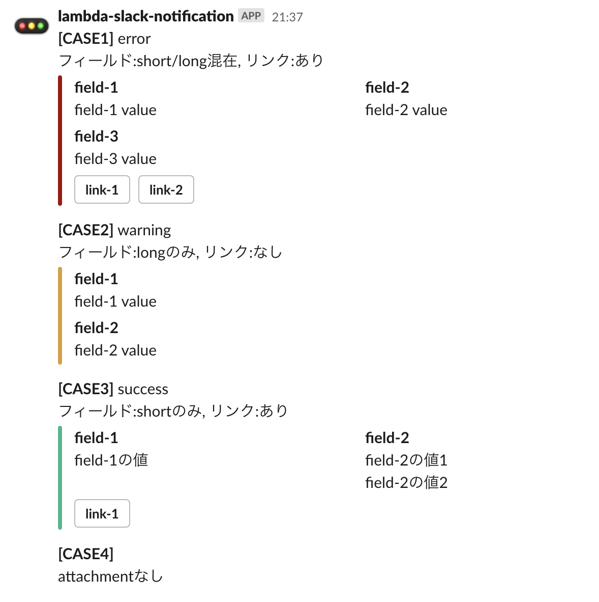

# AWS Lambda Slack Notification Function

## Overview

Slackにメッセージを投稿します。



## Install

### [Slack App](https://api.slack.com/apps)

- OAuth & PermissionsのScope設定
  - Scope
    - `channels:read`
    - `channels:write`
    - `chat:write`
    - `groups:write`
- OAuth & PermissionsのTokenをコピー
  - OAuth Access Token
  - Bot User OAuth Access Token

### Lambda 関数

- [最新のlambda.zip](https://github.com/suwa-sh/lambda-slack-notification/releases/latest) をダウンロード
- [Lambda関数の作成](https://ap-northeast-1.console.aws.amazon.com/lambda/home?region=ap-northeast-1#/create/function)
  - 関数名: `lambda-slack-notification`
  - ランタイム: `Python 3.8`
  - 関数コード.アクション → zipファイルをアップロード: `ダウンロードした最新のlambda.zip`
  - 環境変数
    - SLACK_TOKEN: `Slack App の OAuth Access Token`
    - SLACK_BOT_TOKEN: `Slack App の Bot User OAuth Access Token`
    - SLACK_BOT_ICON: `任意`
    - SLACK_BOT_NAME: `任意`
    - Slack の public channel に通知する場合
      - SLACK_CHANNEL_NAME: `public channel名`
    - Slack の private channel に通知する場合
      - SLACK_CHANNEL_ID: `private channel ID`

## Event Data

### Layout

| 項目 | タイプ | 必須 | 説明 | デフォルト値 |
|:---|:---|:---|:---|:---|
| text | string | true | メッセージ | none |
| attachment | object | false | - | none |
| attachment.status | enum | true | success \| warning \| error | none |
| attachment.fields | list | false | フィールドリスト | none |
| attachment.fields[].is_short | boolean | false | 短いフィールドか？ | true |
| attachment.fields[].title | string | true | フィールド名 | none |
| attachment.fields[].value | string | true | フィールド値 | none |
| attachment.links | list | false | リンクリスト | none |
| attachment.links[].text | string | true | リンクボタンのテキスト | none |
| attachment.links[].url | string | true | リンクボタンのURL | none |

### Sample

```json
  {
    "text": "1行目のメッセージ\n2行目のメッセージ",
    "attachment": {
      "status": "error",
      "fields": [
        {
          "is_short": true,
          "title": "field-1",
          "value": "field-1 value"
        },
        {
          "is_short": true,
          "title": "field-2",
          "value": "field-2 value"
        },
        {
          "is_short": false,
          "title": "field-3",
          "value": "field-3 value"
        }
      ],
      "links": [
        {
          "text": "link-1",
          "url": "http://link-1.example.local"
        },
        {
          "text": "link-2",
          "url": "http://link-2.example.local"
        }
      ]
    }
  }
```
